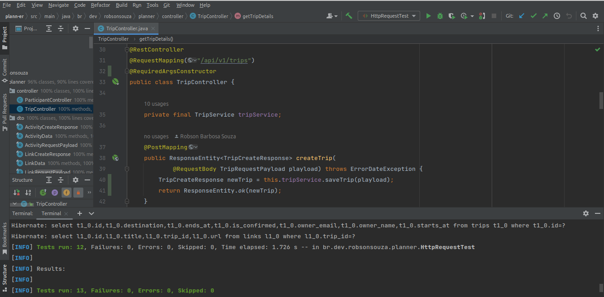
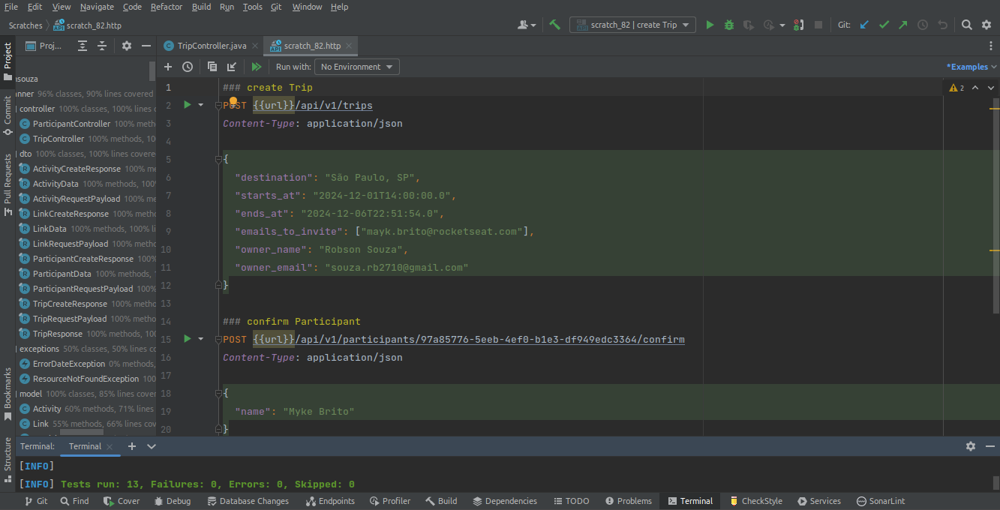

<p align="center">
  

  

  <a href="https://github.com/robsonbs/plann-er-java-back-nlw-journey/commits/master">
    
  </a>

  <a href="https://robsonsouza.dev.br">
    
  </a>
</p>

<h4 align="center"> 
	🚧  Planner # NLW (Trilha Java)🚀 Em Desenvolvimento  🚧
</h4>

<div style="margin:0 auto; width: 1000px;">

</div>

## 🚀 Sobre o projeto

<p>
Projeto Desenvolvido ao longo da 16ª NLW, <b>Journey</b>, onde foi desenvolvido o projeto Plann.er tem como objetivo 
ajudar o usuário a organizar viagens a trabalho ou lazer. O usuário pode criar uma viagem com nome,
data de início e fim. Além disso, pode fazer o convite a outras pessoas que o acompanharão.
Dentro da viagem o usuário pode planejar as atividades para realizar em cada dia e registrar os links mais importantes para o evento.
</p>

---

## 🚀 Como executar o projeto

### Pré-requisitos

Antes de começar, você vai precisar ter instalado em sua máquina as seguintes ferramentas:

- [Git](https://git-scm.com)
- [JDK 21](https://www.oracle.com/java/technologies/javase/jdk21-archive-downloads.html)
- [Maven](https://maven.apache.org/download.cgi)
- [H2](https://www.h2database.com/)

### 🎲 Rodando o Back End (servidor)

```bash

# Clone este repositório
$ git clone https://github.com/robsonbs/plann-er-java-back-nlw-journey.git

#Abra na ide de sua preferencia
# Instale as dependências
$ ./mvnw clean install

# execute o projeto
$ ./mvnw spring-boot:run

# rodando os testes do projeto
$ ./mvnw test
```

### 🛠 Tecnologias

- [Java21](https://www.oracle.com/java/technologies/javase/jdk21-archive-downloads.html)
- [Maven](https://maven.apache.org/download.cgi)
- [Spring Boot](https://spring.io/projects/spring-boot)
- [JPA](https://spring.io/projects/spring-data-jpa)
- [Lombok](https://projectlombok.org/)
- [Flyway](https://flywaydb.org/)
- [DevTools](https://docs.spring.io/spring-boot/docs/current/reference/htmlsingle/#using-boot-devtools)
- [Sping Web](https://spring.io/guides/gs/serving-web-content/)
- [Postman](https://www.postman.com/)

---

## 👩‍💻 Autor

---

<div>
 
 <br />
 <sub><b>Robson Souza</b></sub></div>
Idealizado pela 🚀 Rocketseat e implementado com ❤️ por Robson Souza 👋🏽 Entre em contato!

[](https://www.linkedin.com/in/robson-barbosa-souza-5622a835/)
[](mailto:souza.rb2710@gmail.com)